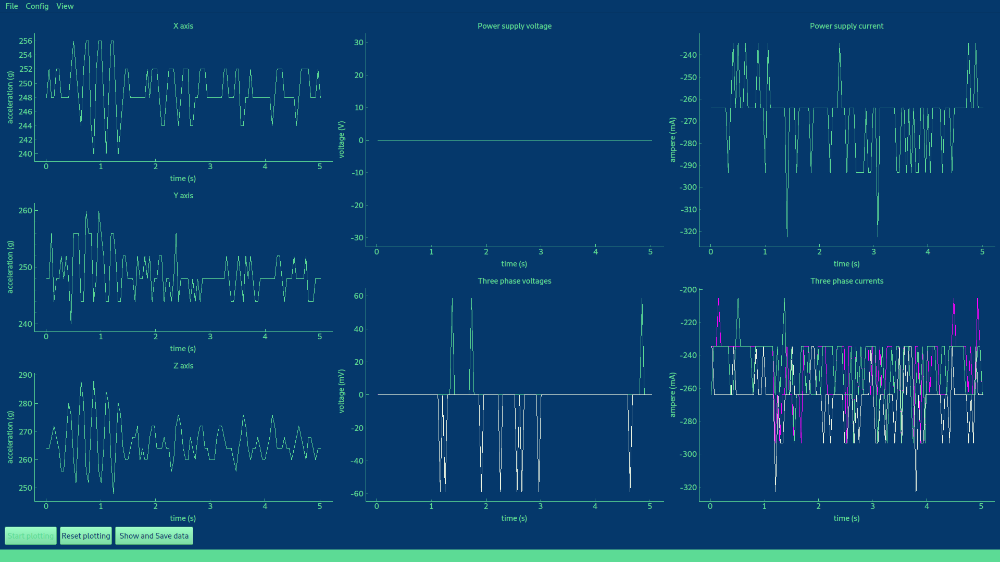
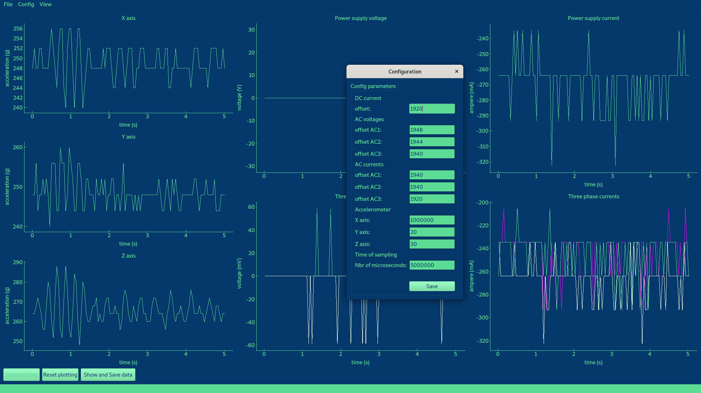
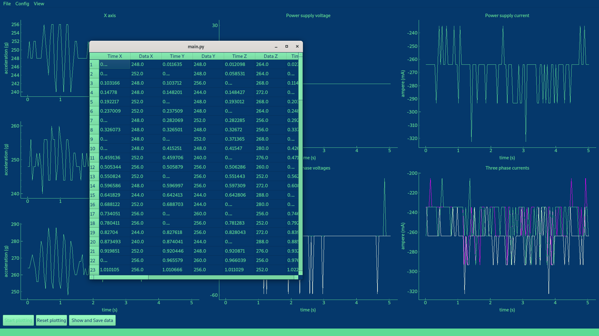

# Picolog 1012 Acquisition Card App
 An application written in Python to display and manage a Picolog 1012 with a DAC for Mirmex Motor.
## How to install
First, you need to install Python (found at https://www.python.org/ ).
<br>Second you need to install some packages (using a terminal):
```
pip install pyqt5
pip install pyqtgraph
pip install pandas
pip install openpyxl
pip install numpy
pip install scipy
```
## The application
All the results are displayed in 7 graphs: the three axis of the accelerometer, the DC power supply voltage and current, the AC phases voltages and currents.<br><br>

## The configuration
You can modify some parameters of the plots using this form.<br><br>

## Export the data
Data is exported when you click on "show and save data". It is exported as an .xlsx Excel sheet. This way you can continue measuring data without losing anything.<br><br>

